[toc]

# Intro To Neural Networks

## Perceptron Algorithm

* the boundary line\plane :
  has the equation{ W*X + b = 0 }:

W : array of weights

X : array of inputs

b : the bias is an error from erroneous
 assumptions in the learning algorithm. High bias can cause an algorithm to miss the relevant relations between features and target outputs (underfitting). Bias is the accuracy of our predictions. A high bias means the prediction will be inaccurate

* prediction:
  y_hat {=1 if WX+b>=0  & 0 if WX+b<0}
* the x's in the equation are the input nodes and the w's are the bridge between x`s and the main node , the main node do the equation and make the output(the line), then the "step function" takes the number and if it is positive then output "1"(true) and if negative output "0"(false)

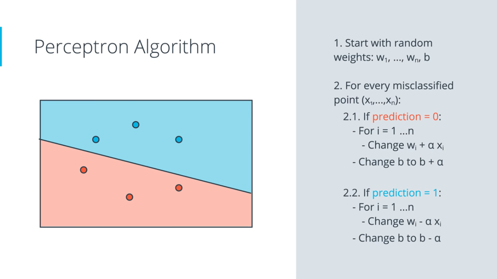

1. Line : 3x1 + 4x2 - 10 = 0  (Wx + b + 0)

2. Point : (4,5)

3. Learning Rate : 0.1

*  if the negative point is in the positive area (prediction = 1) we multiply the x,y points  "and 1 for bias" by the learning rate then subtract the points from the parameters of the line equation. Therefore, if the point is ***above*** the line then a new line equation will be made out of our new parameters **[wi-αxi]** and **[b-α]**:

Line : 2.6x1 + 3.5x2 - 10.1

*  if the positive point is in the negative area (prediction = 0) we multiply the x,y points  "and 1 for bias" by the learning rate then we **add** the points from the parameters of the line equation. Therefore, if the point is ***below*** the line then a new line equation will be made out of our new parameters **[wi+αxi]** and **[b+α]**

## Discrete vs Continuous Predictions

after knowing what a *Perceptron* is and knowing about *Gradient Descent* we will talk about *predictions*

1. Continuous Predictions
2. Discrete Predictions

for us to use *Gradient Descent* we need to apply to the perceptron another *Activation Function* which is the *Sigmoid Function*.
the Sigmoid Function [sigmoid(x) = 1/(1+e^-x)] is like the Step Function but it is used for outputting a continuous probability ex. 0.67 which is a probability of 67% that the student will be accepted because it's more than 0.5
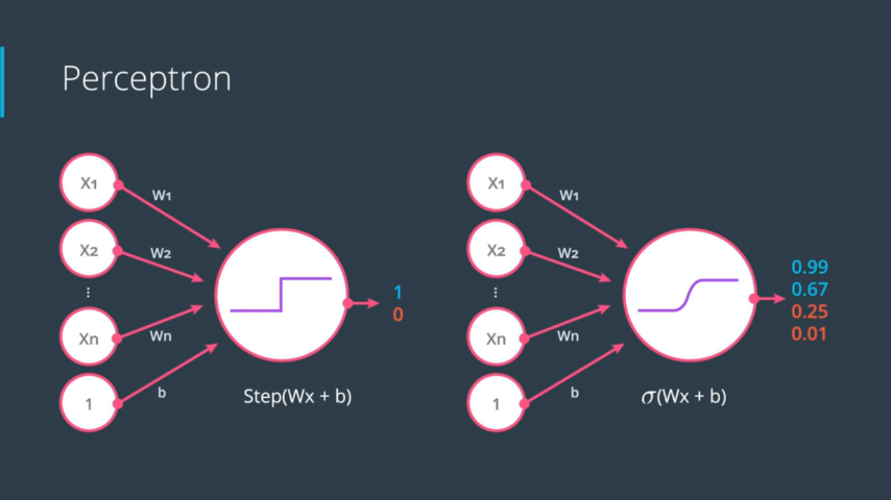

> p(score) = sigmoid(score)

---

## The SoftMax Function

The SoftMax Function is the equivalent of the sigmoid activation function ,but when the problem has 3 or more classes.
the way it works is dividing e^(theValueOfTheClassBeingCalculated) by the sum of e's to the power of the classes. 
$$
p(class ~i) =\frac {e^{Zi} } {e^{Z_1} +...+ e^{Zn}}
$$
where $Z$ is the class score(prediction) of every output node

---

## Maximum Likelihood

Maximum Likelihood means that we need to maximize the probability of a model being correctly classified. The method is calculating the product of the probability of each point being the color it is(for example).

---

## Cross Entropy

If we got a large set of data we can't be calculating the product of each datum, therefore, we will change the product to a sum through logarithms(ln) and we multiply by minus(-) to make the result positive. That's sum called the *Cross Entropy*. We can consider every (-ln(probability)) of a point as the error because the miss classified points will have big numbers while the correctly classified points will have near to the 1 number

> -∑(Yi * ln(Pi) + (1 - Yi) * ln(1 - Pi)) (Binary-class Cross Entropy )

> -∑∑ Yij * ln(pij) (Multi-Class Cross Entropy)

---

## Gradient Descent

$$
w^{k+1} = w^k-\alpha\nabla f(w^k)
$$

where ∇ (nabla) is the gradient which is the same as the slope but it used with multivariable  

#### Momentum

it is one of the methods we do to prevent going into the local minimum problem
$$
\begin{aligned} z^{k+1}&=\beta z^{k}+\nabla f(w^{k})\\[0.4em] w^{k+1}&=w^{k}-\alpha z^{k+1} \end{aligned}
$$

When $\beta = 0$  , we recover gradient descent. But for $\beta = 0.99$ (sometimes $0.999$ if things are really bad) 

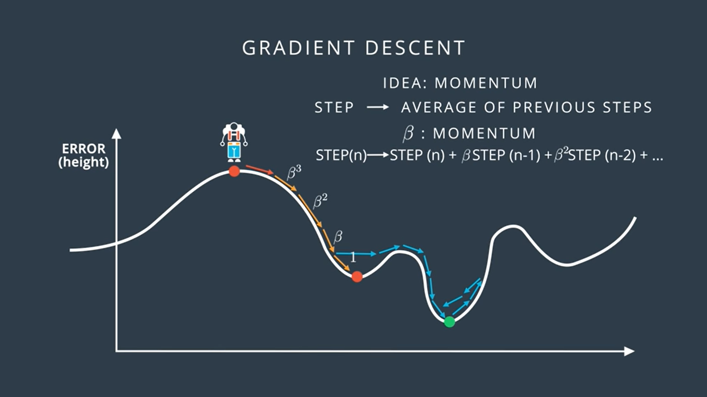

 this appears to be the boost we need to keep the operation from trapping in some local minima

#### random restart

another way to prevent the local ,minima issue is to use **random restart** so that we implement Gradient Descent multiple times and each time we start descending from a random place until we reach a minimum, then we take the smallest restart result available.

#### Batch vs Stochastic Gradient Descent

the Batch one is the normal Gradient Descent which we will apply it for the whole set. Stochastic Gradient Descent on the other hand we take only one set of data (single sample) and apply GD to it

#### Other Optimizers

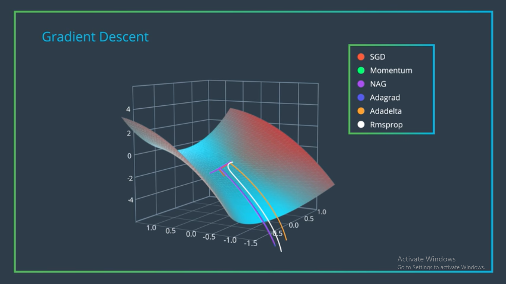

---

## Logistic Regression

1. Take your data
1. Pick a random model
1. Calculate the error
1. Minimize the error, and obtain a better model

but how to calculate the error?. we have a formula for the error function which is:

* if y = 1

  y(blue) = y-hat

  Error = -ln(y-hat)

* if y = 1

  y(red) = 1 - y-hat

  Error = -ln(1 - y-hat)

> 𝐸𝑟𝑟𝑜𝑟(𝑦,𝑦̂) = −𝑦log(𝑦̂ )−(1−𝑦)log(1−𝑦̂ )

> Log Loss Function : - 1/m ∑ (1-yi)(ln(1-yi-hat)) + yi*ln(yi-hat)

> Multi-class Error Function : - 1/m ∑ ∑ yij ln(yij-hat) 

While : **𝑦̂ = σ(Wx + b)**

### Updating the weight and the bias

At each step, you calculate the error and the gradient, then use those to determine how much to change each weight. Repeating this process will eventually find weights that are close to the minimum of the error function

∂E/∂wi = (𝑦 − 𝑦̂)𝑥𝑖

∂E/∂b = (𝑦 − 𝑦̂)

* new-𝑤𝑖 ⟶ 𝑤𝑖 + 𝛼(𝑦 − 𝑦̂)𝑥𝑖

* new-𝑏 ⟶ 𝑏 + 𝛼(𝑦 − 𝑦̂)

### Perceptron vs Gradient Descent

Perceptron Algorithm and Gradient Descent algorithm are the same except that in the perceptron Algorithm 𝑦̂ can take only 0 or 1, and in the gradient descent 𝑦̂ can take any number between 0 and 1
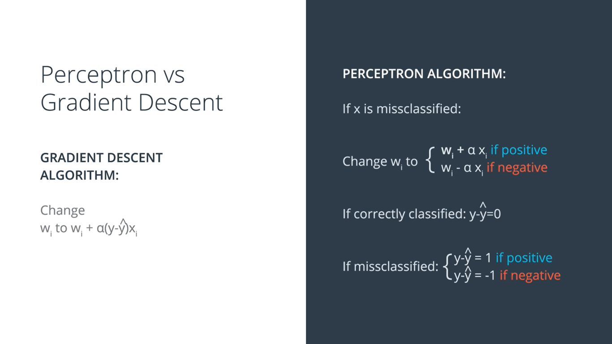

Gradient of the Error Function
$$
∇E=(\frac{∂E}{∂w_1},...,\frac{∂E}{∂w_n},\frac{∂E}{∂b} )
$$

---

## Neural Network Architecture

for naming it a Neural Network we should have at least two-layer perceptron. But firstly, we should know that we can combine two liner models to obtain a third non-linear model by multiplying the probability of a point by the weights then adding the same point in the two regions together(+). Lastly, we apply the sigmoid fun to the result

now, imagine the previous image of probability regions and instead of them we draw circles, yes now they become perceptrons but not any perceptron is a multi-layer perceptron with two layers.
But of course we can made as many layers as we want to make the non-linear model more complex and more specific, the multi-layer called deep neural network with a lot of hidden layers. 

making things a bit terminological, we call the inputs(x1,x2..) *The Input Layer* and the linear models *The Hidden Layer* and the non-linear model *The Output Layer*.

more inputs layer? it will be 3d,4d... model. the output layer has more nodes? more outputs and it will be a multiclass classification model while the outputs will be the probability of the photo if ex. it's a cat, a beaver or a walrus, and the output with the highest probability will be the animal. more hidden layers? then it's a Deep Neural Network

---

## Multilayer Perceptrons(MLPs)

MLPs get vector as an input

In the next chapter we will learn about *backpropagation* but before that we need additional technical knowledge in perceptrons to get into it.

$𝑦̂ = σ · W^3 σ · W^2 σ · W^1 (x)$ 

we will learn equation next but we need to understand it first

here every $$W^1,W^2...$$ will contain every weight $$W_{11},W_{12}$$ and we will call the bias $$ W_i $$ which is the last index of the matrix, like if the inputs are two and there weights are $$ W_{11...}$$  and $$W_{21...}$$ the bias will be like if it’s the last one $$W_{31...}$$  

Now to index the weights, we take the input unit number for the $i$ and the hidden unit number for the $j$. That gives us for the weight leading from $x_1$ to $h_2$, $w_{12}$

now, for calculating $h$. We should know that  the weights have a matrix and the inputs have arrays so for getting $h$ we need to multiply them with each other but there is a rule for that.

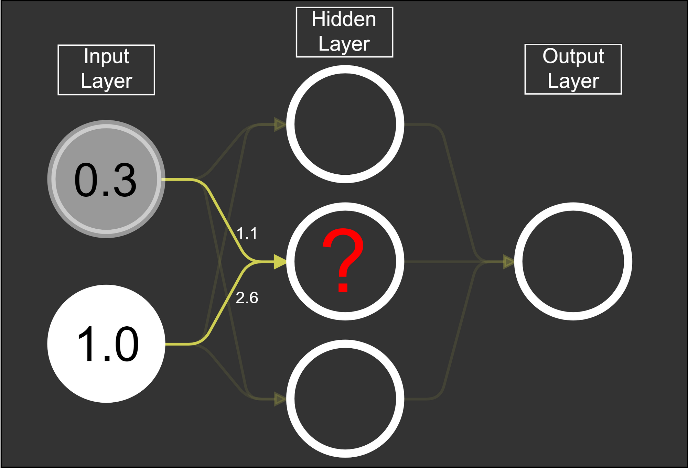  in this example 1.1×0.3+2.6×1.0 = 2.93 which is the “?”

The rule is that if you're multiplying an array from the left, the array must have the same number of elements as there are rows in the matrix. And if you're multiplying the *matrix* from the left, the number of columns in the matrix must equal the number of elements in the array on the right.

---

## backpropagation

backpropagation is the reverse of Feedforward and it is simply the **adjusting the weights and biases** throughout the network, so that we get the desired output in the output layer. Say we wanted the output neuron to be 1.0, then we would need to nudge the weights and biases so that we get an output closer to 1.0

now, we need to calculate the error not just on the output node, but on every hidden layer so that we could update the weights (train them). Before we’ve updated the weights by implementing on the output node so that we updated the hidden to output weights, but to train the input to hidden weights we will implement the error function on every node of our hidden layer.

[CS231n Convolutional Neural Networks for Visual Recognition](https://cs231n.github.io/optimization-2/#backprop)

$$
\delta^h_j = (\sum_k W_{jk} \delta^o_k) f'(h_j)
$$

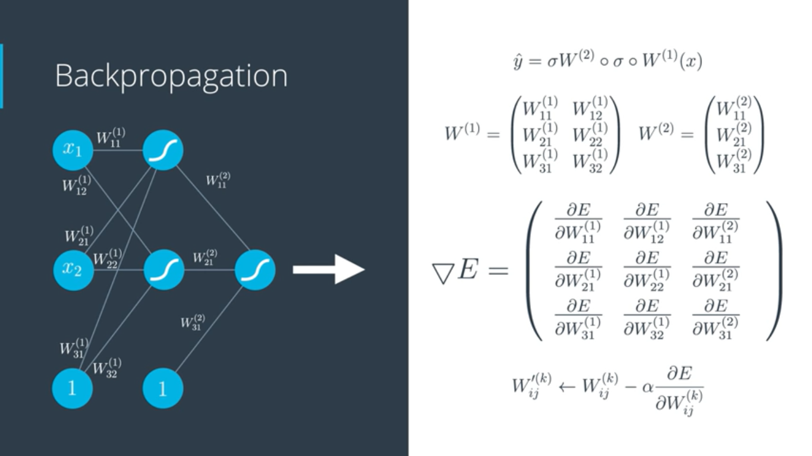

### Feedforward

Feedforward is the process neural networks use to turn the input into an output

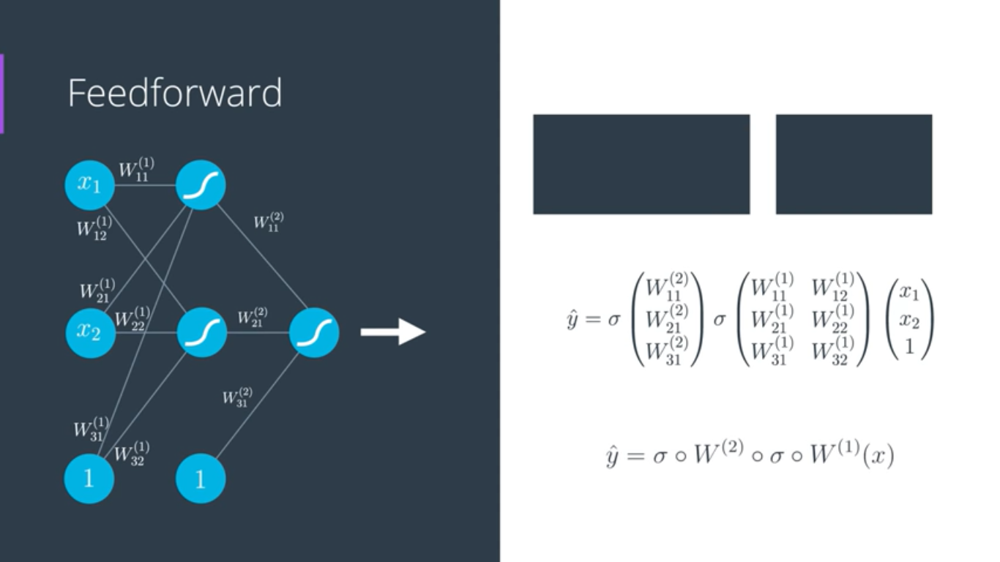

>  $$
>  𝑦̂ = σ · W^3 σ · W^2 σ · W^1 (x)
>  $$
>
>  

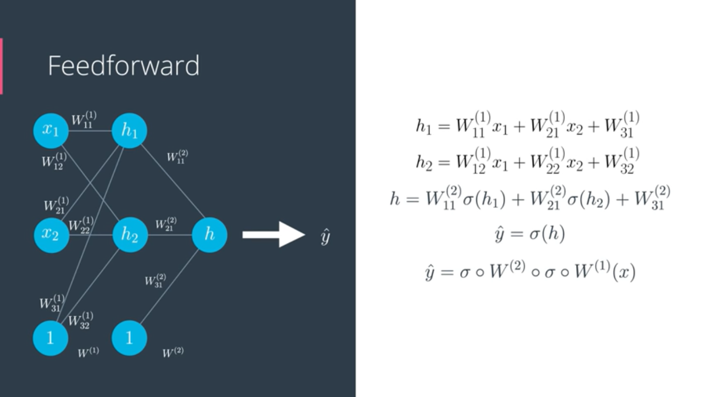 so the procedure is the same moving forward in the network of neurons, hence the name **feedforward neural network**

---

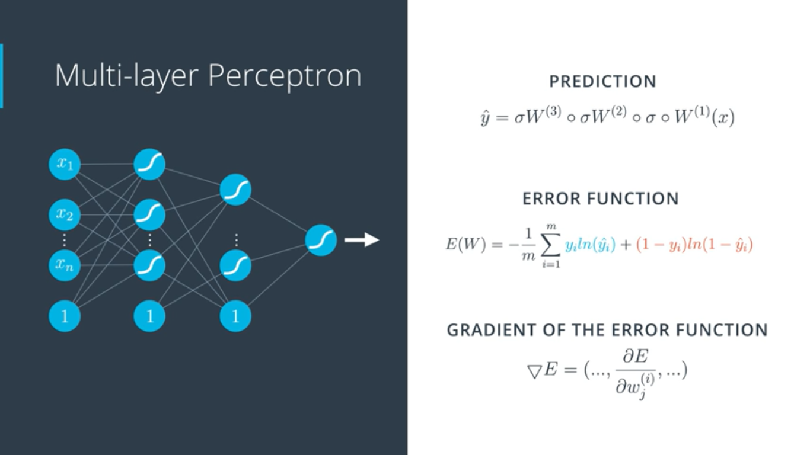

now since we know about feedforward, we will start training our neural network using *backpropagation* method which consists of:

1. Doing a feedforward operation.
2. Comparing the output of the model with the desired output.
3. Calculating the error.
4. Running the feedforward operation backwards (backpropagation) to spread the error to each of the weights.
5. Use this to update the weights, and get a better model. 
6. Continue this until we have a model that is good.

The **backpropagation** algorithm works by computing the gradient of the loss **function** with respect to each weight by the chain rule, computing the gradient one layer at a time, iterating backward from the last layer to avoid redundant calculations of intermediate terms in the chain rule

### Chain Rule

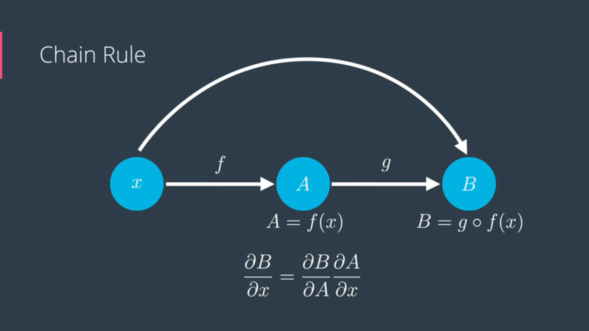
$$
\frac{∂B}{∂x}=\frac{∂B}{∂A} \frac{∂A}{∂x}
$$

------

## Implementing Gradient Descent

now we’ve been introduced to another kind of error formula it is the **Mean Squared Error** and it is given by the formula:

$$
E = \frac{1}{2m}\sum_{\mu} \sum_j \left[ y^{\mu}_j - \hat{y} ^{\mu}_j \right]^2
$$
$$
where $\hat y$ is the prediction and $y$ is the true value, $j$ is the output unit. and $\mu$ is the data point.  $\hat y$ is given by the formula:
$$
$$
\hat{y}^{\mu}_j = f \left( \sum_i{ w_{ij} x^{\mu}_i }\right)
$$

$$
~~~~~~~~~~~~~w_i = w_i + Δ w_i\\[0.4em]

~~~~~~~~~~~Δ w_i = -∇\\[0.4em]
 
~~~~~~~~~~~~Δ w_i=-\eta\frac{∂E}{∂w_i}\\[0.4em]
 
~~~~~~\frac{∂E}{∂w_n}=-(y-\hat y) \frac{∂\hat y}{∂w_i}\\
\hat y=f(h) ~~~~~where ~~~~ h=\sum_i w_ix_i
$$

$ ~~~~~~~~~~~~ $     
$$
\frac{∂E}{∂w_n}=-(y-\hat y)f'(x)x_i
$$

$$
Δ w_i=\eta(y-\hat y)f'(x)x_i
$$

$$
\delta=(y-\hat y)f'(h)
$$

$$
w_i=w_i+\eta~\delta~x_i
$$

If multiple output units:
$$
\delta_j=(y_j-\hat y_j)f'(h_j)
$$
**the Gradient descent step **:
$$
Δ w_{ij}=\eta~\delta_jx_i
$$

 in the above equations $(y - \hat y)$ is the output error, $f'(h)$ refers to the derivative of the activation function $f(h)$,  $\eta$ is the learning rate, $\delta$ is the error term, and $Δ w_i$ is the weight change(weight step)

**the general algorithm for updating the weights with gradient descent:****

* Set the weight step to zero: $\Delta w_i = 0$
* For each record in the training data:
  * Make a forward pass through the network, calculating the output $\hat y = f(\sum_i w_i x_i)$
  * Calculate the error term for the output unit, $\delta = (y - \hat y) * f'(\sum_i w_i x_i)$
  * Update the weight step$\Delta w_i = \Delta w_i + \delta x_i$
* Update the weights $w_i = w_i + \frac{\eta \Delta w_i } {m}$where $\eta$ is the learning rate and m*m* is the number of records. Here we're averaging the weight steps to help reduce any large variations in the training data.
* Repeat for $e$ epochs.

## Implementing Backpropagation

* Calculate the network's output error(forward pass).
* Calculate the output layer's error term.
* Use backpropagation to calculate the hidden layer's error term.
* Calculate the change in weights (the delta weights) that result from propagating the errors back through the network.

the general algorithm for updating the weights with backpropagation:

* Set the weight steps for each layer to zero

  * The input to hidden weights $\Delta w_{ij} = 0$
  * The hidden to output weights $\Delta W_j =0$

* For each record in the training data:

  * Make a forward pass through the network, calculating the output $\hat y$

  * Calculate the error gradient in the output unit,

     $\delta^o = (y - \hat y) f'(z)$ where $z = \sum_j W_j a_j$  the input to the output unit.

  * Propagate the errors to the hidden layer $\delta^h_j = \delta^o W_j f'(h_j)$

  * Update the weight steps:

    * $\Delta W_j = \Delta W_j + \delta^o a_j$
    * $\Delta w_{ij} = \Delta w_{ij} + \delta^h_j a_i$

* Update the weights, where \eta*η* is the learning rate and m*m* is the number of records:

  * $W_j = W_j + \eta \frac {\Delta W_j}{m}$
  * $w_{ij} = w_{ij} + \eta \frac {\Delta w_{ij}}{m}$

* Repeat for $e$ epochs.

## Overfitting

there is many ways to prevent our model from overfitting :

### 1- Regularization

$$
\frac {1}m ∑ (1-yi)(ln(1-\hat y_i)) + yi~ln(\hat y_i)~+ \lambda \sum_n |w_n|
$$

but in the L2 we replace the last addition by $\lambda \sum_n w_n^2$

* we do it to overcome the overfitting issue
* **overfitting** is an issue where you have a lot of different features but a little training data that your line try to fit as much data as possible so we need remove some features
* Performing L2 regularization has the following effect on a model :

  * Encourages weight values toward 0 (but not exactly 0)

  * Encourages the mean of the weights toward 0, with a normal (bell-shaped or Gaussian) distribution.
    Increasing the lambda value strengthens the regularization effect
* When choosing a **lambda** value, the goal is to strike the right balance between simplicity and training-data fit:

  *  If your lambda value is too high, your model will be simple, but you run the risk of underfitting your data. Your model won't learn enough about the training data to make useful predictions.

  *  If your lambda value is too low, your model will be more complex, and you run the risk of overfitting your data. Your model will learn too much about the particularities of the training data, and won't be able to generalize to new data.
* **L1 Regularization(lasso):**

>we add the absolute coefficients to the error(|W|)

* **L2 Regularization:**

>we add the square of the coefficients to the error(W^2)

| L1 Regularization                                  | L2 Regularization         |
| -------------------------------------------------- | :------------------------ |
| computationally inefficient(unless date is sparse) | computationally efficient |
| sparse output                                      | non-sparse output         |
| feature selection                                  | no feature selection      |

### 2- Dropout

to prevent our model from overfitting we can use a parameter to shutdown some nodes through epochs, the parameter will represent the probability each node will be dropped. So during every epoch some node will be shut until we finish training

## Other Activation Functions 

#### Hyperbolic Tangent Function

$$
tanh(x)=\frac {e^ x - e^{-x}}{e^ {-x} + e^x}
$$

and it is a function that returns a value between -1 and 1

#### Rectified Linear Unit (ReLU)

$$
relu(x)=(x ~~if~~x>_=0)\\~~~~~~~~~~~~~~~~~~(0 ~~if~~x<0)
$$

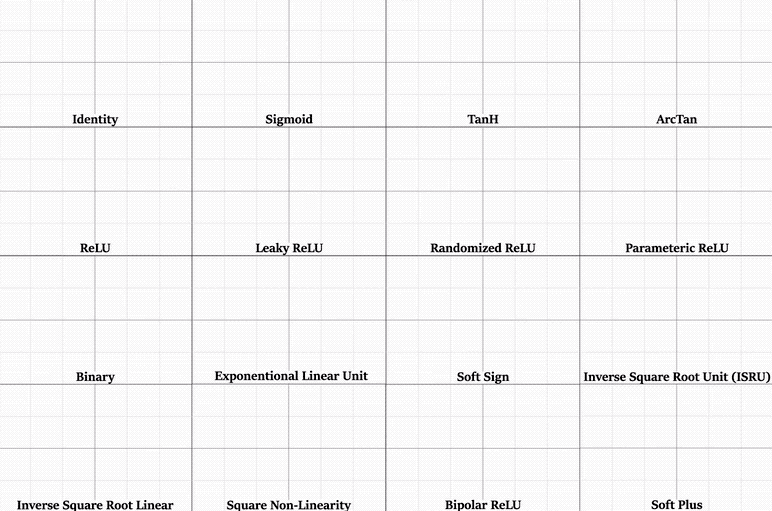

## Solidifying Our MLP Concepts

* **Class Score**: is the prediction of our network. A higher score means that the network is more certain that the input is of that particular class.

* but what if the network didn't predict correctly, here we learn from our mistakes by:
  1.  *Loss*: measure the difference (mistakes) between a predicted and true class labels(how far off the model currently is from perfection)
  2. *Backpropagation*: quantify how bad a particular weight is in making a mistake, and find out which weight in the network are responsible for any errors
  3. Optimization(ex. gradient descent): gives us a way to calculate a better weight value

#### Model Validation

we learned before that we must use a *Test Set* to check the accuracy of our model. Now we should use a third set (in addition to the *Training Set* that we used it to update the weights) which is a *Validation Set* because we must know how well the model generalizes, also using a validation set will prevent overfitting because we will know through the set how many epochs we need. because as the loss of our training set decreases and the epochs increases there will be a place where the loss of the validation set stat increasing as the epochs continue and this is a sign of overfitting. on that place, we should stop iterating 

and as an exercise we will try to develop an image classifier using Pytorch and here are the steps

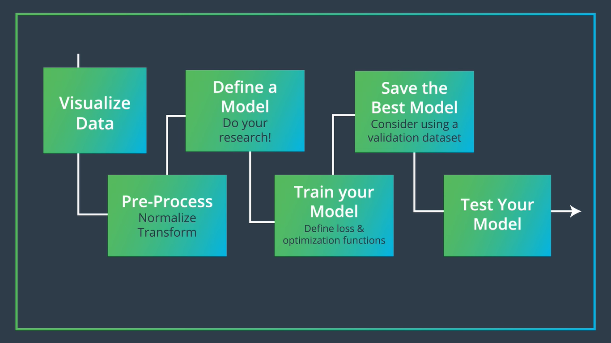

## Convolutional Neural Networks (CNNs)

**MNIST Data**  is arguably the most famous database in the field of deep learning and it is a dataset of 70,000 images of hand written digits 

